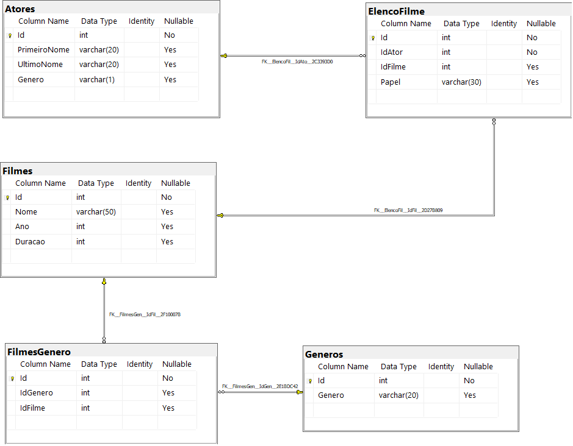

# 🚀 DESAFIO DE PROJETO

### DIO - Trilha .NET - Banco de Dados

## Desafio de projeto
Para este desafio, você precisará usar seus conhecimentos adquiridos no módulo de banco de dados, da trilha .NET da DIO.

## Contexto
Você é responsável pelo banco de dados de um site de filmes, onde são armazenados dados sobre os filmes e seus atores. Sendo assim, foi solicitado para que você realize uma consulta no banco de dados com o objetivo de trazer alguns dados para análises.

## Proposta
Você precisará realizar 12 consultas ao banco de dados, cada uma retornando um tipo de informação.
O seu banco de dados está modelado da seguinte maneira:



As tabelas sao descritas conforme a seguir:

|Tabela|Descrição|
|---|---|
|**Filmes**|Tabela responsável por armazenar informações dos filmes.|
|**Atores**|Tabela responsável por armazenar informações dos atores.|
|**Generos**|Tabela responsável por armazenar os gêneros dos filmes.|
|**ElencoFilme**|Tabela responsável por representar um relacionamento do tipo muitos para muitos entre filmes e atores, ou seja, um ator pode trabalhar em muitos filmes, e filmes podem ter muitos atores.|
|**FilmesGenero**|Tabela responsável por representar um relacionamento do tipo muitos para muitos entre filmes e gêneros, ou seja, um filme pode ter mais de um gênero, e um genêro pode fazer parte de muitos filmes.|

## Preparando o banco de dados
Você deverá executar o arquivo **Script Filmes.sql** em seu banco de dados SQL Server, presente na pasta Scripts deste repositório ([ou clique aqui](./script.sql)). Esse script irá criar um banco chamado **Filmes**, contendo as tabelas e os dados necessários para você realizar este desafio.

## Objetivo
Você deverá criar diversas consultas, com o objetivo de retornar os dados a seguir. Abaixo de cada pedido tem o retorno esperado. O seu retorno deve ser igual ao da imagem.

### 1. Buscar o nome e ano dos filmes
```sql
    SELECT 
        Nome, 
        Ano
    FROM Filmes
```


### 2. Buscar o nome e ano dos filmes, ordenados por ordem crescente pelo ano
```sql
    SELECT 
        Nome, 
        Ano, 
        Duracao
    FROM Filmes
    ORDER BY Ano
```


### 3. Buscar pelo filme de volta para o futuro, trazendo o nome, ano e a duração
```sql
    SELECT 
        Nome, 
        Ano, 
        Duracao
    FROM Filmes
    WHERE Nome LIKE 'de volta para o futuro'
```


### 4. Buscar os filmes lançados em 1997
```sql
    SELECT *
    FROM Filmes
    WHERE Ano = 1997
```


### 5. Buscar os filmes lançados APÓS o ano 2000
```sql
    SELECT *
    FROM Filmes
    WHERE Ano > 2000
```


### 6. Buscar os filmes com a duracao maior que 100 e menor que 150, ordenando pela duracao em ordem crescente
```sql
    SELECT *
    FROM Filmes
    WHERE Duracao > 100 AND Duracao < 150
    ORDER BY Duracao
```


### 7. Buscar a quantidade de filmes lançadas no ano, agrupando por ano, ordenando pela quantidade em ordem decrescente
```sql
    SELECT 
        Ano, 
        COUNT(*) AS Quantidade
    FROM Filmes
    GROUP BY Ano
    ORDER BY Quantidade DESC;
```


### 8. Buscar os Atores do gênero masculino, retornando o PrimeiroNome, UltimoNome
```sql
    SELECT 
        PrimeiroNome, 
        UltimoNome, 
        Genero
    FROM Atores
    WHERE Genero LIKE 'm'
```


### 9. Buscar os Atores do gênero feminino, retornando o PrimeiroNome, UltimoNome, e ordenando pelo PrimeiroNome
```sql
    SELECT 
        PrimeiroNome, 
        UltimoNome, 
        Genero
    FROM Atores
    WHERE Genero LIKE 'f'
    ORDER BY PrimeiroNome
```


### 10. Buscar o nome do filme e o gênero
```sql
    SELECT 
        F.Nome, 
        G.Genero
    FROM Filmes F
    JOIN FilmesGenero FG 
        ON F.Id = FG.IdFilme
    JOIN Generos G 
        ON FG.IdGenero = G.Id
```


### 11. Buscar o nome do filme e o gênero do tipo "Mistério"
```sql
    SELECT 
        F.Nome, 
        G.Genero
    FROM Filmes F
    JOIN FilmesGenero FG
        ON F.Id = FG.IdFilme
    JOIN Generos G
        ON FG.IdGenero = G.Id
    WHERE G.Genero = 'Mistério'
```


### 12. Buscar o nome do filme e os atores, trazendo o PrimeiroNome, UltimoNome e seu Papel
```sql
    SELECT
        F.Nome,
        A.PrimeiroNome, 
        A.UltimoNome, 
        EF.Papel
    FROM Filmes F
    JOIN ElencoFilme EF
        ON F.Id = EF.IdFilme
    JOIN Atores A
        ON EF.IdAtor = A.Id
```


<br>
<br>
<br>
<br>

<hr>
<div align="center">
   👋 Feito com ❤️ by Izael Silva 👋
<br>
<br>
<br>
   créditos:
<a href="https://web.dio.me/home" target="_blank">


</a>
</div>